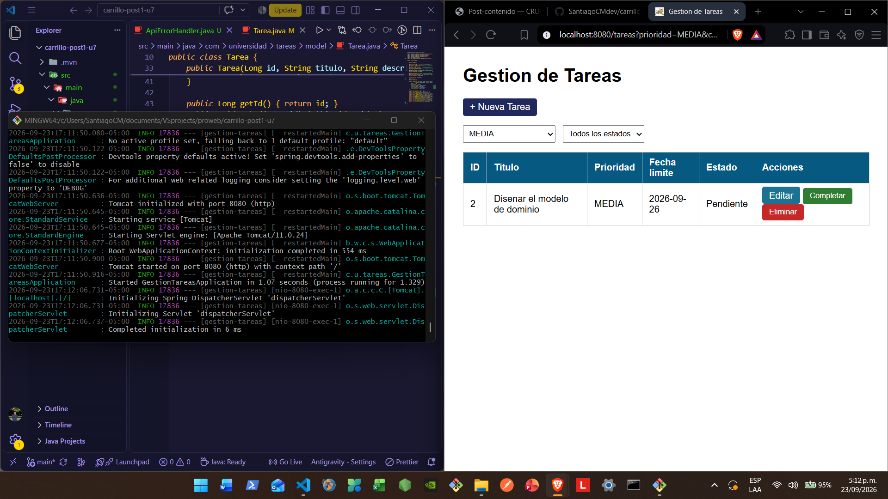
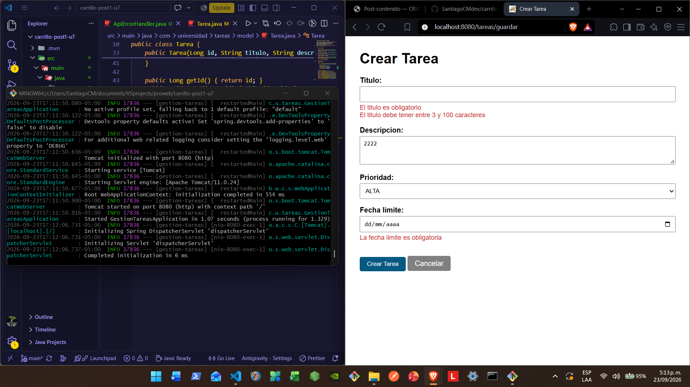
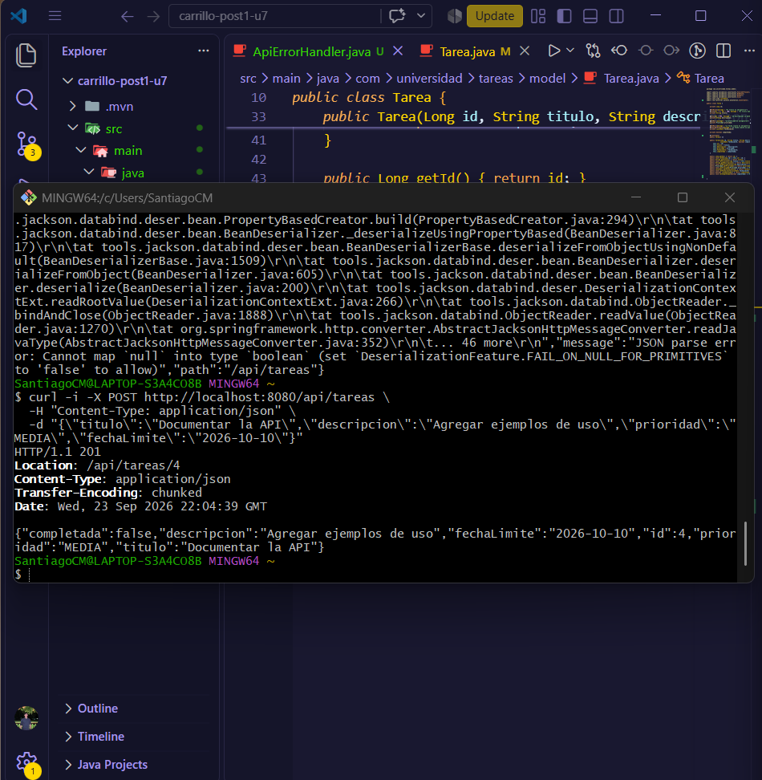
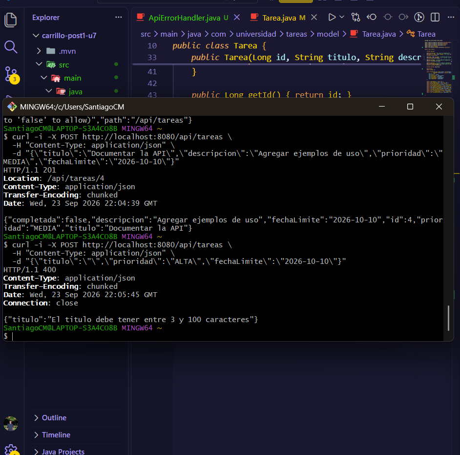

# Post-contenido - Unidad 7: Gestion de Tareas con Spring Boot

## Descripcion
Repositorio del laboratorio de la Unidad 7 de Programacion Web - Septimo
Semestre. Un unico proyecto Spring Boot con dos capas sobre el mismo
TareaService: una vista Thymeleaf (@Controller, parte 1) y una API REST
(@RestController, parte 2).

## Parte 1 - Vista Thymeleaf con @Controller
TareaController expone /tareas con filtrado por @RequestParam (prioridad,
completada), formularios validados con @Valid + BindingResult, y las
acciones completar/eliminar implementadas como POST (no GET) para no
introducir efectos secundarios en peticiones de solo lectura.

## Parte 2 - API REST con @RestController
TareaApiController expone /api/tareas con los verbos GET, POST, PUT,
PATCH y DELETE, inyectando por constructor la MISMA instancia de
TareaService que usa la Parte 1. ApiErrorHandler traduce los errores de
@Valid en JSON estructurado (400 Bad Request), en vez de la pantalla de
error HTML por defecto de Spring Boot.

## Decisiones de diseno
- Inyeccion por constructor (no @Autowired en campo) en ambos
  controladores: mejora la testabilidad y hace explicita la dependencia.
- @FutureOrPresent en lugar de @Future en fechaLimite: permite tareas
  con vencimiento el mismo dia de su creacion.
- POST (no GET) para completar/eliminar en TareaController: una peticion
  GET debe ser segura y no debe modificar estado del servidor.
- PATCH (no PUT) para /api/tareas/{id}/completar: representa una
  actualizacion parcial de un unico campo, no el reemplazo del recurso.
- Manejo de validacion separado por capa: BindingResult para la vista
  HTML, @RestControllerAdvice para la API JSON, cada una responde en el
  formato que le corresponde.
- Persistencia en memoria (Map en TareaService) en lugar de JPA/Hibernate:
  la persistencia real se introduce formalmente en la Unidad 8.

## Como compilar y ejecutar
1. Clonar el repositorio: git clone [URL-del-repo]
2. Abrir la carpeta como proyecto Maven en VS Code
3. Ejecutar mvn spring-boot:run
4. Vista web: http://localhost:8080/tareas
   API REST: http://localhost:8080/api/tareas

## Capturas de pantalla

